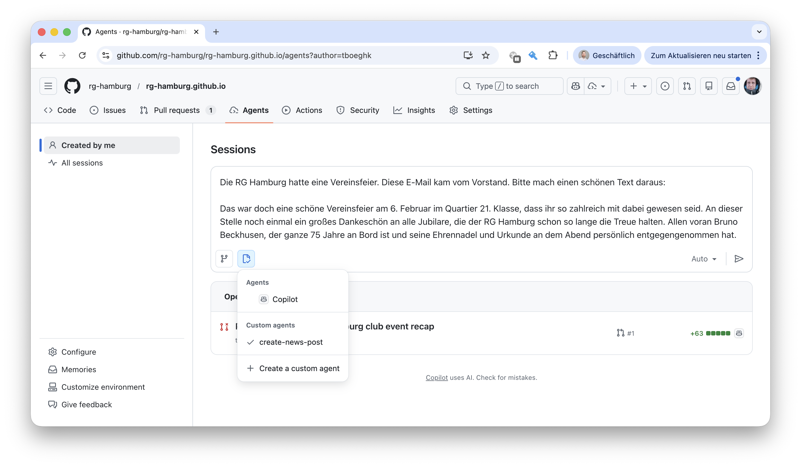
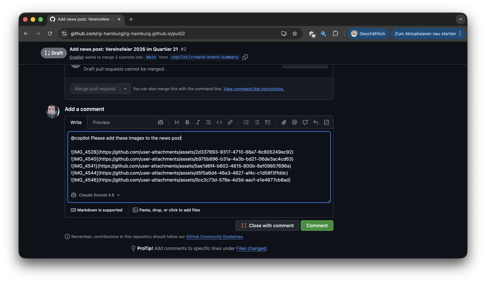

# 🌍 RG Hamburg Website

Dies ist die Webseite der RG Hamburg. Die Website wird aus diesen Sourcen
als statische Seite generiert und auf GitHub Pages gehostet.

## Projektaufbau

Wir nutzen [Jekyll](https://jekyllrb.com/) als statischen Website-Generator.
Die HTML-Templates sind dabei getrennt von den Inhalten abgelegt. Wir versuchen,
die Hauptinhalte im [Markdown-Format](https://www.markdownguide.org/) in
dedizierten Dateien vorzuhalten.

Zur besseren Übersicht findest Du hier gute Startpunkte:

| Was | Wo | Hinweise |
|-----|----|----------|
| News-Beiträge | `_posts/YYYY-MM-DD-slug.md` | Markdown mit Front Matter (`title`, `date`, `image`, `alt`, `tag`). Der erste Absatz wird automatisch als Vorschau-Text auf der Übersichtsseite verwendet. |
| Bilder für News | `assets/images/news/` | Hero-Bild im Front Matter als `news/dateiname.jpg` referenzieren. Für Galerien zusätzlich `gallery:` mit `file` und `alt` angeben. |
| Veranstaltungen | `_data/events.yaml` | Karten auf der Aktuelles-Seite. |
| Probetraining | `_data/probetraining.yaml` | CTA-Abschnitt am Seitenende. |
| Statische Seiten | `verein.md`, `impressum.md`, `satzung.md`, … | Layout `prose` — reines Markdown, kein HTML nötig. |

Generelle Seiten-Einstellungen (Kontakt, Instagram, Navigation etc.) kannst
Du in der `_data/site.yaml` konfigurieren.

## Inhalte hinzufügen / bearbeiten

Typische Aktionen oder Änderungen, die regelmäßig ausgeführt werden, sind
hier beschrieben. Alle Aktionen sind auf dem klassischen Weg und KI-unterstützt möglich.

#### 🗞️ News-Artikel

Öffne die [GitHub Agenten](agents) und wähle über das Frosch-Symbol den
`create-news-post` Agenten aus. Im Textfeld gib Stichworte/Texte und/oder
Links zum News-Post ein. Der Agent formuliert den Text für Dich.



Sobald Copilot den Text geschrieben und die nötigen Inhalte im Projekt
angelegt hat, erstellt er einen Pull Request. Öffne den Pull Request und
hänge dort Bilder an, die Du dem Artikel hinzufügen möchtest. Schreibe
`@copilot` dass er die Bilder an den news post anhängen soll. Wenn Du
noch weitere Wünsche hast, lass es ihn wissen.



Copilot arbeitet dann ein wenig. Wenn Du mit dem Text zufrieden bist,
kannst du den Pull Request akzeptieren. Deine Änderungen sind dann innerhalb
weniger Minuten online.

#### 🎭 Veranstaltung

...

## 🚀 Lokal ausführen

Um Deine Änderungen lokal zu testen, kannst Du die Webseite mit Docker
bauen lassen. Nach dem Start ist sie unter [localhost:4000](https://localhost:4000) erreichbar.

```bash
docker compose up
```

## 📚 Disclaimer

Diese Webseite ist zu 100% vibe gecoded. Danke [Claude Code](https://claude.ai).
